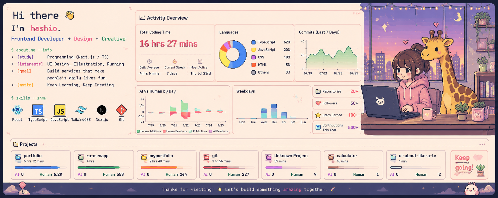

<!-- テーマのベース背景色 -->
<!-- &theme=calm&animation=draw&duration=3 -->

# 👋 Hi, I'm Hashio

Wwb開発やデザインを中心に、Webサイト制作やプログラミングの学習、作品制作に取り組んでいます。

I focus on web development and design, engaging in activities such as website creation, learning programming, and producing projects.



## 📁 Repository Categories

GitHub上のリポジトリは、制作内容ごとに番号で分類しています。

Repositories on GitHub are categorized by number according to the content of the work.

| No.    | Category    | Description                                                                                              |
| ------ | ----------- | -------------------------------------------------------------------------------------------------------- |
| **00** | Practice    | プログラミングやWeb制作の学習・練習用<br>For learning and practicing programming and web development                      |
| **01** | Websites    | GitHub Pagesなどで公開しているWebサイト・Web制作物<br>Websites and web projects published on platforms like GitHub Pages |
| **02** | Small Works | 小作品・実験的な制作物・コレクション<br>Small-scale works, experimental projects, and collections                          |


---

## 🛠 Technologies & Skills & Tools --> (*) is learning mark

### Frontend
[](https://skillicons.dev)

* HTML
* CSS
* JavaScript(*)
* p5.js
* OpenProcessing
* React(*)


### Backend / Programming
[](https://skillicons.dev)

* PHP(*)
* Python
* TypeScript(*)
* Java(*)
* Django
* Flask
* Pandas


### Database
[](https://skillicons.dev)
* MySQL
* PostgreSQL(*)

### CMS
[](https://skillicons.dev)
* WordPress

### Server / Hosting / DNS

* さくらインターネット
* お名前.com

### Development Tools
[](https://skillicons.dev)

* Visual Studio Code
* Eclipse
* Git
* GitHub
* GitHub Pages
* FileZilla

### Operating Systems
[](https://skillicons.dev)
* Windows
* macOS
* Linux
* Ubuntu
* Debian

### Shell / Command Line
[](https://skillicons.dev)
- PowerShell
- Bash
- Terminal


### Design Tools
[](https://skillicons.dev)
* Adobe Photoshop
* Adobe Lightroom
* Adobe Fresco
* Adobe Illustrator
* Adobe Premiere
* Adobe After Effects
* Adobe XD
* Figma
* Blender(*)


---

## 📊 GitHub Activity

[](https://github.com/stats-organization/github-stats-extended)


---

## 📈 GitHub Statistics


---


## 💻 Development Activity

<!--START_SECTION:waka-->


**🐱 My GitHub Data** 

> 📦 ? Used in GitHub's Storage 
 > 
> 🏆 412 Contributions in the Year 2026
 > 
> 🚫 Not Opted to Hire
 > 
> 📜 9 Public Repositories 
 > 
> 🔑 0 Private Repositories 
 > 
**I'm an Early 🐤** 

```text
🌞 Morning                64 commits          █████░░░░░░░░░░░░░░░░░░░░   21.55 % 
🌆 Daytime                123 commits         ██████████░░░░░░░░░░░░░░░   41.41 % 
🌃 Evening                91 commits          ████████░░░░░░░░░░░░░░░░░   30.64 % 
🌙 Night                  19 commits          ██░░░░░░░░░░░░░░░░░░░░░░░   06.40 % 
```
📅 **I'm Most Productive on Thursday** 

```text
Monday                   10 commits          █░░░░░░░░░░░░░░░░░░░░░░░░   03.37 % 
Tuesday                  36 commits          ███░░░░░░░░░░░░░░░░░░░░░░   12.12 % 
Wednesday                74 commits          ██████░░░░░░░░░░░░░░░░░░░   24.92 % 
Thursday                 84 commits          ███████░░░░░░░░░░░░░░░░░░   28.28 % 
Friday                   45 commits          ████░░░░░░░░░░░░░░░░░░░░░   15.15 % 
Saturday                 35 commits          ███░░░░░░░░░░░░░░░░░░░░░░   11.78 % 
Sunday                   13 commits          █░░░░░░░░░░░░░░░░░░░░░░░░   04.38 % 
```


📊 **This Week I Spent My Time On** 

```text
🕑︎ Time Zone: Asia/Tokyo

💬 Programming Languages: 
CSS                      7 hrs 3 mins        ██████████░░░░░░░░░░░░░░░   42.00 % 
HTML                     3 hrs 21 mins       █████░░░░░░░░░░░░░░░░░░░░   19.95 % 
Markdown                 2 hrs 44 mins       ████░░░░░░░░░░░░░░░░░░░░░   16.28 % 
TypeScript               2 hrs 43 mins       ████░░░░░░░░░░░░░░░░░░░░░   16.21 % 
JSON                     21 mins             █░░░░░░░░░░░░░░░░░░░░░░░░   02.11 % 

🔥 Editors: 
VS Code                  16 hrs 48 mins      █████████████████████████   100.00 % 

🐱‍💻 Projects: 
portfolio                6 hrs 31 mins       ██████████░░░░░░░░░░░░░░░   38.79 % 
ra-menapp                3 hrs 53 mins       ██████░░░░░░░░░░░░░░░░░░░   23.10 % 
git                      1 hr 56 mins        ███░░░░░░░░░░░░░░░░░░░░░░   11.53 % 
myportfolio              1 hr 41 mins        ███░░░░░░░░░░░░░░░░░░░░░░   10.08 % 
tyutai-kun               1 hr 28 mins        ██░░░░░░░░░░░░░░░░░░░░░░░   08.79 % 

💻 Operating System: 
Mac                      16 hrs 48 mins      █████████████████████████   100.00 % 
```

**I Mostly Code in HTML** 

```text
HTML                     4 repos             ██████████░░░░░░░░░░░░░░░   40.00 % 
JavaScript               3 repos             ████████░░░░░░░░░░░░░░░░░   30.00 % 
Python                   3 repos             ████████░░░░░░░░░░░░░░░░░   30.00 % 
```


**Timeline**


 Last Updated on 24/07/2026 19:54:20 UTC
<!--END_SECTION:waka-->


---

## 🌈 GitHub 3D Contribution


---


## 🎓 Certifications

- 情報セキュリティマネジメント試験 — 2025年取得
  - Information Security Management Examination — Obtained in 2025

---

## 🌱 Currently Learning

フロントエンド・バックエンドのWeb開発を中心に、サーバー・DNS・データベースなど、WebサイトやWebアプリケーションが動く仕組みについて学んでいます。

I am learning about the mechanisms that power websites and web applications—including servers, DNS, and databases—with a primary focus on frontend and backend web development.


また、GitHubを活用したバージョン管理やチーム開発、Issue・Projects・Pull Requestなどを使った開発フローについても学習しています。

I am also learning about version control and team development using GitHub, as well as development workflows that utilize features such as Issues, Projects, and Pull Requests.

---

## 📌 Portfolio

GitHub Pagesやポートフォリオサイトを通して、制作したWebサイトや作品を公開しています。

I showcase the websites and projects I have created via GitHub Pages and my portfolio site.

---

## 🔗 Github Pages Collection

[portfolioSite](https://hashio251.github.io/index.html)
[]

